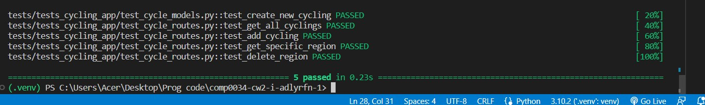

# COMP0034 Coursework 2

## Set-up

You will need to a Python environment e.g create and activate a venv.

Install the packages from requirements.txt using `pip install -r requirements.txt`

To run the code pass through the following command via terminal `flask --app 'cycling_app:create_app()' --debug run`

To run the tests pass through ` python -m pytest -vv tests/tests_cycling_app/ -W ignore::DeprecationWarning`

### The routes

The following routes were designed for the API.

| HTTP method | URL | Body | Response | Where the data is |
|:---- |:---- |:---- |:---- | :---- |
| GET | api/cyclings | None | Returns a list of all cycling data and their details in JSON format | `prepared_central_london_(area).csv` |
| GET | api/cyclings/{location}/{survey_date}/{time}/{direction} | None | Returns the region name and notes for a given code | `prepared_central_london_(area).csv` |
| POST | api/cyclings | Survey_wave, Location, Survey_date, Weather, Time, Period, Direction, Number_of_private_cycles, Number_of_cycle_hire_bikes, Total_cycles, Year, cycling_id| Return all the details of the updated cycling data record|`prepared_central_london_(area).csv` | `prepared_central_london_(area).csv` |
| PATCH | api/cyclings/{location}/{survey_date}/{time}/{direction} | Changed fields for the cycling data record | Status code 200 if new NOC code was saved. | `prepared_central_london_(area).csv` |
| DELETE | api/cyclings/{location}/{survey_date}/{time}/{direction} | None | Removes a cycling data record and if successful returns  200 (Accepted) | `prepared_central_london_(area).csv` |

### Testing

